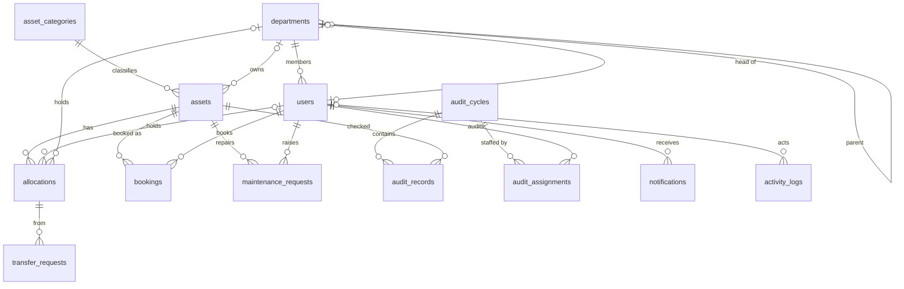

# AssetFlow — Database Design

> PostgreSQL 16 · Prisma ORM · All business-critical invariants enforced **in the database**, not only in application code.

## 1. Design principles

1. **Integrity lives in the database.** Application checks give friendly errors; constraints make corruption impossible. Double allocation and booking overlap are *structurally impossible*, not merely validated.
2. **History is append-only.** Allocations, maintenance, audits, and activity are never updated destructively — lifecycle facts accumulate as rows.
3. **No hard deletes for master data.** Users, departments, categories, and assets deactivate via status; referential history stays intact (`ON DELETE RESTRICT`).
4. **Derived state is computed, not duplicated.** `isOverdue`, booking phase (Upcoming/Ongoing/Completed), and health score derive from source columns — no drift possible.
5. **UUID primary keys** (`gen_random_uuid()`), `timestamptz` everywhere, snake_case in SQL mapped to camelCase DTOs via Prisma `@map`.

**Extensions:** `pgcrypto` (UUIDs), `btree_gist` (booking exclusion constraint).

## 2. Entity-Relationship Diagram



## 3. Enumerations

| Enum | Values |
|---|---|
| `user_role` | `ADMIN` · `ASSET_MANAGER` · `DEPT_HEAD` · `EMPLOYEE` |
| `record_status` | `ACTIVE` · `INACTIVE` (users, departments, categories) |
| `asset_status` | `AVAILABLE` · `ALLOCATED` · `RESERVED` · `UNDER_MAINTENANCE` · `LOST` · `RETIRED` · `DISPOSED` |
| `asset_condition` | `NEW` · `GOOD` · `FAIR` · `POOR` |
| `allocation_status` | `ACTIVE` · `RETURNED` |
| `transfer_status` | `PENDING` · `APPROVED` · `REJECTED` · `CANCELLED` |
| `booking_status` | `CONFIRMED` · `CANCELLED` (Upcoming/Ongoing/Completed are **time-derived**, see §7.3) |
| `maintenance_status` | `PENDING` · `APPROVED` · `REJECTED` · `ASSIGNED` · `IN_PROGRESS` · `RESOLVED` |
| `maintenance_priority` | `LOW` · `MEDIUM` · `HIGH` · `CRITICAL` |
| `audit_cycle_status` | `OPEN` · `CLOSED` |
| `audit_result` | `VERIFIED` · `MISSING` · `DAMAGED` |

## 4. Tables

### 4.1 `users`
| Column | Type | Notes |
|---|---|---|
| id | uuid PK | |
| name | text NOT NULL | |
| email | text NOT NULL | normalized lowercase at the boundary; `UNIQUE` |
| password_hash | bcrypt text NOT NULL | never selected by default (Prisma omit) |
| role | user_role NOT NULL DEFAULT 'EMPLOYEE' | **signup can only ever produce EMPLOYEE**; role changes go through the role-assignment endpoint (admin-guarded) |
| department_id | uuid NULL FK → departments RESTRICT | |
| status | record_status NOT NULL DEFAULT 'ACTIVE' | inactive users cannot authenticate |
| created_at / updated_at | timestamptz | |

Indexes: `UNIQUE(email)`, `(department_id)`, `(role)`.

### 4.2 `departments`
| Column | Type | Notes |
|---|---|---|
| id | uuid PK | |
| name | text NOT NULL UNIQUE | |
| description | text NULL | |
| head_id | uuid NULL FK → users SET NULL | |
| parent_id | uuid NULL FK → departments RESTRICT | hierarchy; cycles rejected in service layer via recursive CTE check |
| status | record_status NOT NULL DEFAULT 'ACTIVE' | |
| created_at / updated_at | timestamptz | |

### 4.3 `asset_categories`
| Column | Type | Notes |
|---|---|---|
| id | uuid PK | |
| name | text NOT NULL UNIQUE | |
| description | text NULL · icon text NOT NULL | |
| fields | jsonb NOT NULL DEFAULT '[]' | field definitions `[{key,label,type,required}]` — powers dynamic category-specific inputs (e.g. warranty months for Electronics) |
| status | record_status NOT NULL DEFAULT 'ACTIVE' | |
| created_at / updated_at | timestamptz | |

### 4.4 `assets`
| Column | Type | Notes |
|---|---|---|
| id | uuid PK | |
| asset_tag | text NOT NULL UNIQUE | `AF-0001` — from sequence, see §6 |
| name | text NOT NULL | |
| category_id | uuid NOT NULL FK RESTRICT | |
| serial_number | text NULL UNIQUE | |
| acquisition_date | date NULL | |
| acquisition_cost | numeric(12,2) NULL `CHECK (acquisition_cost >= 0)` | reporting only — deliberately not linked to any accounting concern |
| condition | asset_condition NOT NULL DEFAULT 'GOOD' | |
| location | text NULL | |
| photo_url | text NULL | |
| custom_field_values | jsonb NULL | values for the category's field definitions; validated against them at the boundary |
| is_bookable | boolean NOT NULL DEFAULT false | shared/limited resources (rooms, vehicles, equipment) |
| status | asset_status NOT NULL DEFAULT 'AVAILABLE' | transitions guarded by state machine (§7.1) |
| department_id | uuid NULL FK RESTRICT | owning department |
| created_by_id | uuid NOT NULL FK → users | |
| created_at / updated_at | timestamptz | |

Indexes: `(status)`, `(category_id)`, `(department_id)`, `(location)`, `(is_bookable) WHERE is_bookable`.

### 4.5 `allocations` — who holds what
| Column | Type | Notes |
|---|---|---|
| id | uuid PK | |
| asset_id | uuid NOT NULL FK RESTRICT | |
| holder_user_id | uuid NULL FK → users | |
| holder_department_id | uuid NULL FK → departments | |
| allocated_by_id | uuid NOT NULL FK → users | |
| allocated_at | timestamptz NOT NULL DEFAULT now() | |
| expected_return_at | timestamptz NULL | overdue when `< now()` and still ACTIVE — derived, never stored |
| returned_at | timestamptz NULL · return_condition asset_condition NULL · return_notes text NULL | check-in capture |
| status | allocation_status NOT NULL DEFAULT 'ACTIVE' | |
| notes | text NULL | |

**Constraints (the core conflict rules):**
```sql
-- exactly one holder: employee XOR department
CHECK ((holder_user_id IS NULL) <> (holder_department_id IS NULL))

-- an asset can have AT MOST ONE active allocation — double allocation is
-- impossible at the storage layer, regardless of application bugs or races
CREATE UNIQUE INDEX uq_allocations_one_active
  ON allocations(asset_id) WHERE status = 'ACTIVE';

-- returned rows are complete
CHECK (status = 'ACTIVE' OR returned_at IS NOT NULL)
```
Indexes: partial index above, `(holder_user_id)`, `(holder_department_id)`, `(expected_return_at) WHERE status='ACTIVE'` (overdue scanner).

### 4.6 `transfer_requests`
| Column | Type | Notes |
|---|---|---|
| id | uuid PK · asset_id FK · from_allocation_id FK → allocations | |
| requested_by_id | uuid FK → users | |
| target_user_id / target_department_id | uuid NULL | `CHECK` exactly one, same XOR as allocations |
| reason | text NOT NULL | |
| status | transfer_status DEFAULT 'PENDING' | |
| decided_by_id | uuid NULL FK · decided_at timestamptz NULL · decision_note text NULL | |
| created_at | timestamptz | |

```sql
-- one open transfer request per asset at a time
CREATE UNIQUE INDEX uq_transfers_one_pending
  ON transfer_requests(asset_id) WHERE status = 'PENDING';
```
Approval is transactional: close old allocation (`RETURNED`) → insert new `ACTIVE` allocation → mark request `APPROVED`. The partial unique index in §4.5 makes this race-safe.

### 4.7 `bookings` — time-slot reservations
| Column | Type | Notes |
|---|---|---|
| id | uuid PK · asset_id FK (must be `is_bookable`) | |
| booked_by_id | uuid FK → users · for_department_id uuid NULL FK | |
| purpose | text NOT NULL | |
| start_at / end_at | timestamptz NOT NULL | `CHECK (end_at > start_at)` |
| status | booking_status DEFAULT 'CONFIRMED' | |
| cancelled_at | timestamptz NULL · reminder_sent_at timestamptz NULL | |
| created_at | timestamptz | |

**The overlap constraint (flagship):**
```sql
ALTER TABLE bookings ADD CONSTRAINT no_booking_overlap
  EXCLUDE USING gist (
    asset_id WITH =,
    tstzrange(start_at, end_at, '[)') WITH &&
  ) WHERE (status = 'CONFIRMED');
```
- Half-open range `[)` ⇒ 09:00–10:00 and 10:00–11:00 **coexist** (back-to-back legal); 09:30–10:30 **collides** — exactly the specified rule.
- Enforced by the storage engine under concurrency: two simultaneous requests for the same slot cannot both commit. The service layer pre-checks to return a friendly 409 with alternative-slot suggestions; the constraint is the unbreakable backstop.
- Cancelled bookings leave the exclusion set automatically (`WHERE` clause), freeing the slot.

Indexes: gist (above), `(asset_id, start_at)`, `(booked_by_id)`.

### 4.8 `maintenance_requests`
| Column | Type | Notes |
|---|---|---|
| id uuid PK · asset_id FK · raised_by_id FK | | |
| title text · description text · priority maintenance_priority · photo_url NULL | | |
| status | maintenance_status DEFAULT 'PENDING' | workflow §7.2 |
| decided_by_id NULL FK · decided_at NULL · rejection_reason NULL | | approval stage |
| technician_name NULL · assigned_at NULL · started_at NULL | | execution stage |
| resolved_at NULL · resolution_notes NULL · cost numeric(12,2) NULL `CHECK (cost >= 0)` | | closure |
| created_at / updated_at | timestamptz | |

Index: `(asset_id, created_at DESC)` (per-asset history), `(status)`.

### 4.9 `audit_cycles`, `audit_assignments`, `audit_records`
```
audit_cycles: id PK · name · department_id NULL FK · location NULL ·
              start_date date · end_date date CHECK (end_date >= start_date) ·
              status audit_cycle_status DEFAULT 'OPEN' ·
              created_by_id FK · closed_at NULL · created_at

audit_assignments: cycle_id FK CASCADE + auditor_id FK  → PK (cycle_id, auditor_id)

audit_records: id PK · cycle_id FK CASCADE · asset_id FK RESTRICT ·
               auditor_id NULL FK · result audit_result NULL ·
               notes NULL · checked_at NULL
               UNIQUE (cycle_id, asset_id)
```
Cycle creation **snapshots scope**: all assets matching department/location filters are materialized as `audit_records` with `result = NULL`. Auditors fill results; `UNIQUE(cycle_id, asset_id)` prevents duplicate verdicts. Closing is transactional: cycle → `CLOSED` (immutable thereafter — guarded in service), confirmed `MISSING` assets → status `LOST`, discrepancy notifications fan out.

### 4.10 `notifications`
```
id PK · user_id FK CASCADE · type text · title text · body text ·
entity_type NULL · entity_id NULL · is_read bool DEFAULT false · created_at
INDEX (user_id, is_read, created_at DESC)
```

### 4.11 `activity_logs` — append-only audit trail
```
id PK · actor_id NULL FK SET NULL · action text ·
entity_type text · entity_id text · summary text ·
metadata jsonb NULL · created_at
INDEX (entity_type, entity_id) · INDEX (actor_id) · INDEX (created_at DESC)
```
Written by a global interceptor on every mutating request — no code path can forget to log. No UPDATE/DELETE ever issued against this table.

## 5. Integrity constraint catalog (summary)

| # | Invariant | Mechanism |
|---|---|---|
| C1 | One active allocation per asset (no double allocation) | partial unique index `WHERE status='ACTIVE'` |
| C2 | No overlapping confirmed bookings per resource | `EXCLUDE USING gist` on `tstzrange` |
| C3 | Holder is employee XOR department | `CHECK` on allocations & transfer targets |
| C4 | Booking duration valid, back-to-back allowed | `CHECK (end_at > start_at)` + half-open range |
| C5 | One pending transfer per asset | partial unique index `WHERE status='PENDING'` |
| C6 | One verdict per asset per audit cycle | `UNIQUE (cycle_id, asset_id)` |
| C7 | Non-negative money | `CHECK` on cost columns |
| C8 | No dangling references / history loss | FK `RESTRICT` on master data, status-deactivation instead of delete |
| C9 | Unique natural keys | asset_tag, serial_number, email, department & category names |

## 6. Asset tag generation

Dedicated sequence, race-safe, gap-tolerant:
```sql
CREATE SEQUENCE asset_tag_seq START 1;
-- service: SELECT nextval('asset_tag_seq') → format 'AF-' || lpad(n::text, 4, '0')
```
Tag format `AF-0001`; padding widens naturally past 9999 (`AF-10001`). The `UNIQUE` on `asset_tag` backstops any manual insert.

## 7. State machines

### 7.1 Asset lifecycle (enforced in `AssetStateMachine` service — single authority for every status write)

| From → To | Trigger |
|---|---|
| AVAILABLE → ALLOCATED | allocation created |
| AVAILABLE → RESERVED | confirmed booking window begins (scheduler) |
| AVAILABLE → UNDER_MAINTENANCE | maintenance request approved |
| AVAILABLE → RETIRED | retire action |
| RESERVED → AVAILABLE | booking window ends / booking cancelled |
| ALLOCATED → AVAILABLE | return completed |
| ALLOCATED → UNDER_MAINTENANCE | maintenance approved while held |
| UNDER_MAINTENANCE → ALLOCATED | resolved and an ACTIVE allocation exists (returns to holder) |
| UNDER_MAINTENANCE → AVAILABLE | resolved, no active allocation |
| UNDER_MAINTENANCE → RETIRED | unrepairable |
| any except DISPOSED → LOST | audit cycle closed with confirmed MISSING |
| LOST → AVAILABLE | mark-found |
| RETIRED → DISPOSED | dispose action (terminal) |

Any transition not listed is rejected with `409 INVALID_STATE_TRANSITION`. Guards: allocate requires `AVAILABLE`; retire requires no active allocation, no future confirmed bookings, no open maintenance; book requires `is_bookable` and status ∉ {LOST, RETIRED, DISPOSED}.

### 7.2 Maintenance workflow
`PENDING → APPROVED | REJECTED` (Asset Manager) · `APPROVED → ASSIGNED` (technician set) · `ASSIGNED → IN_PROGRESS` · `IN_PROGRESS → RESOLVED`. Side effects: approval flips asset to `UNDER_MAINTENANCE`; resolution flips it back per §7.1. `REJECTED`/`RESOLVED` terminal.

### 7.3 Booking phase (derived, never stored)
`CANCELLED` if cancelled; else `UPCOMING` (now < start) / `ONGOING` (start ≤ now < end) / `COMPLETED` (now ≥ end). Computed in SQL/service at read time — a booking can never hold a stale phase.

### 7.4 Transfer workflow
`PENDING → APPROVED | REJECTED | CANCELLED` (requester may cancel). Approval executes the §4.6 transaction.

## 8. Asset Health Score (computed metric)

Deterministic 0–100 score, computed at read time (SQL expression / service function) — never stored, never stale:

```
score = 100
  − condition penalty: NEW 0 · GOOD 5 · FAIR 15 · POOR 30
  − age penalty: min(20, full_years_since_acquisition × 4)
  − maintenance load: min(30, maintenance_requests_in_last_12_months × 6)
  − 10 if any open CRITICAL maintenance request
clamped to [0, 100]
```
Bands: **HEALTHY ≥ 80** · **MONITOR 50–79** · **AT_RISK < 50**. Drives the asset-detail health ring, the health-distribution report, and the "nearing retirement" list (AT_RISK ∪ RETIRED-candidates).

## 9. Migrations & seeding

- Prisma Migrate is the single source of schema truth; every change is a committed migration.
- Postgres features Prisma cannot express (C2 exclusion constraint, partial indexes, sequence) live in **hand-edited migration SQL** (`prisma migrate dev --create-only`, then edit) — reviewed like code, replayable from zero.
- `prisma db seed` is idempotent (upserts by natural key): departments, categories with custom fields, users in every role, assets across all seven statuses, allocations incl. overdue, back-to-back and future bookings, maintenance in every state, one open + one closed audit cycle, notifications, activity history. A fresh checkout reaches a demo-ready database with `docker compose up -d && prisma migrate dev && prisma db seed`.

## 10. Performance & scaling notes

- Every FK and every hot filter column indexed (§4); list endpoints are keyset-paginatable later, offset-paginated now with `LIMIT/OFFSET` + total counts.
- Reports run as SQL aggregates (GROUP BY status/category/department, `width_bucket` for heatmap hours) — no N+1, no in-memory aggregation.
- `activity_logs` and `notifications` are append-only and time-indexed; at scale they partition by month (BRIN on `created_at`) without schema change.
- Stateless API ⇒ horizontal scale behind a pool (PgBouncer) — constraints C1/C2 keep correctness under any concurrency.
